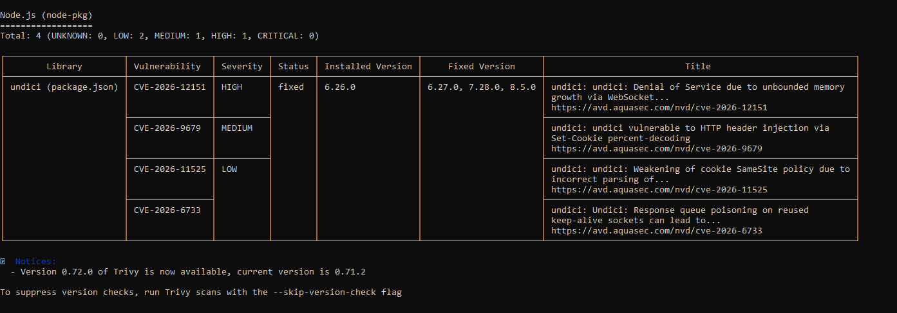

Danh sách thành viên nhóm:
    1. Nguyễn Thành Hưng

Phân chia công việc:
    1. Làm báo cáo: Nguyễn Thành Hưng
    2. Chuẩn bị bài Demo: Nguyễn Thành Hưng

Link github:
    https://github.com/BossAnos/secure-webapp-demo

Giới thiệu đề tài:
    Trong bối cảnh chuyển đổi số và sự phát triển mạnh mẽ của các ứng dụng web hiện đại, nhu cầu triển khai phần mềm nhanh chóng, linh hoạt và dễ mở rộng ngày càng trở nên quan trọng. Công nghệ container hóa đã trở thành một trong những giải pháp được nhiều doanh nghiệp và tổ chức lựa chọn nhờ khả năng đóng gói ứng dụng cùng toàn bộ môi trường thực thi, giúp đảm bảo tính nhất quán giữa các giai đoạn phát triển, kiểm thử và triển khai. Trong đó, Docker được sử dụng rộng rãi để xây dựng và triển khai container, còn Kubernetes đóng vai trò điều phối, quản lý và mở rộng các container trong môi trường vận hành thực tế.

    Bên cạnh những lợi ích về hiệu năng và khả năng mở rộng, việc sử dụng Docker và Kubernetes cũng đặt ra nhiều thách thức về an toàn thông tin. Nếu Docker Image chứa lỗ hổng bảo mật, container được cấu hình với quyền quá cao hoặc các thông tin nhạy cảm như mật khẩu cơ sở dữ liệu, API Key và Access Token được lưu trực tiếp trong mã nguồn hoặc Docker Image, hệ thống có thể trở thành mục tiêu của các cuộc tấn công mạng, gây rò rỉ dữ liệu hoặc ảnh hưởng đến hoạt động của ứng dụng.

    Nhận thấy tầm quan trọng của vấn đề này, đề tài “Bảo mật container web (Docker/Kubernetes) – Demo Hardening Image và Secret Management” được thực hiện nhằm nghiên  cứu các giải pháp nâng cao mức độ an toàn cho ứng dụng web khi triển khai trên nền tảng container. Đề tài tập trung vào hai nội dung chính là Hardening Docker Image, giúp giảm thiểu các lỗ hổng và bề mặt tấn công của container, và Secret Management, giúp quản lý các thông tin nhạy cảm một cách an toàn thông qua Kubernetes Secret thay vì lưu trực tiếp trong mã nguồn hoặc tệp cấu hình.

    Báo cáo không chỉ trình bày cơ sở lý thuyết về Container, Docker và Kubernetes mà còn xây dựng mô hình thực nghiệm để minh họa quá trình triển khai và áp dụng các giải pháp bảo mật. Thông qua việc so sánh giữa mô hình chưa áp dụng và đã áp dụng các biện pháp bảo mật, đề tài đánh giá hiệu quả của Hardening Docker Image và Secret Management trong việc giảm thiểu rủi ro, nâng cao tính an toàn và tăng khả năng bảo vệ ứng dụng trước các mối đe dọa phổ biến trong môi trường container hóa.

    Kết quả của đề tài góp phần giúp người học hiểu rõ hơn về các nguy cơ bảo mật trong Docker và Kubernetes, đồng thời cung cấp những kiến thức và kinh nghiệm thực tế trong việc xây dựng, triển khai và bảo vệ các ứng dụng web hiện đại. Đây cũng là nền tảng quan trọng để tiếp tục nghiên cứu và áp dụng các giải pháp bảo mật nâng cao trong môi trường điện toán đám mây và kiến trúc Microservices.

Hướng dẫn chạy kèm theo hình ảnh chụp một số kết quả demo:
    Phần 1: Docker Image Hardening
        1.1 Kịch bản không an toàn
            # Build image không an toàn
            docker build -t webapp:insecure -f insecure/Dockerfile .

            # Kiểm tra image chạy với quyền gì
            docker run --rm webapp:insecure whoami

            # Quét lỗ hổng bằng Trivy
            trivy image webapp:insecure

        Kết quả mô phỏng:
            
        
        1.2 Kịch bản an toàn
            docker build -t webapp:secure -f secure/Dockerfile .

            # Xác nhận user đang chạy
            docker run --rm webapp:secure whoami

            docker run --rm webapp:secure id

            trivy image webapp:secure
        
        Kết quả mô phỏng:
            
            

    Phần 2: Demo Secret Managment
        2.1 Kịch bản không an toàn
            docker compose -f docker-compose.insecure.yaml up

            #Lấy CONTAINER ID
            docker ps -a

            # Kiểm tra rò rỉ qua docker inspect
            docker inspect <container_id> --format "{{.Config.Env}}"
            

            # Kiểm tra rò rỉ qua git
            git log -p --all | findstr /I "DB_PASSWORD"
            

        2.2 Kịch bản an toàn
            # 1. Khởi động cluster
            minikube start --driver=docker

            # 2. Tạo .env rồi chạy lệnh sau
            docker compose -f docker-compose.secure.yaml up

            # 3. Build image bên trong Minikube
            docker build -t webapp:secure -f secure/Dockerfile .

            # 4. Tạo namespace
            kubectl create namespace production

            # 5. Apply Secret, Deployment, Service
            kubectl apply -f k8s/k8s-secret.yaml
            kubectl apply -f k8s/k8s-deployment.yaml
            kubectl apply -f k8s/k8s-service.yaml

            # 6. Kiểm tra Pod
            kubectl get pods -n production

            # 7. Cho phép Kubernetes tự động tải ảnh về
            minikube image load webapp:secure

            # 8. Xác nhận secret + non-root user
            kubectl exec -it <tên-pod> -n production -- whoami
            kubectl exec -it <tên-pod> -n production -- env | grep DB_PASSWORD
            kubectl exec -it <tên-pod> -n production -- cat /etc/secrets/DB_PASSWORD

            # 8. Truy cập web app
            docker run --rm -p 3000:3000 webapp:secure
                
            or

            docker run --rm -p 3000:3000 -e APP_ENTRY=app-secure-config.js -e DB_PASSWORD=P@ssw0rd123! -e JWT_SECRET=mysupersecretkey -e DB_HOST=localhost  webapp:secure
                
